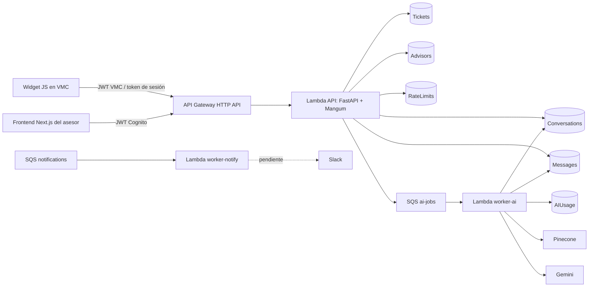

# Auditoría técnica y plan de corrección de Subastín

**Fecha de la auditoría:** 2026-09-02

**Alcance:** backend, arquitectura, persistencia DynamoDB, workers SQS/Lambda, infraestructura CDK,
seguridad, widget embebible, frontend Next.js, dependencias, CI y estrategia de pruebas.

**Estado del repositorio durante la revisión:** sin cambios locales previos; `DETAILS.md` fue el
único archivo añadido por la auditoría.

**Objetivo de este documento:** registrar los hallazgos y convertirlos en una secuencia ejecutable
de correcciones y pruebas, sin mezclar bloqueantes de producción con mejoras cosméticas.

---

## 1. Resumen ejecutivo

El repositorio tiene una base backend sólida para un MVP. No es un backend de código espagueti:
existen límites reconocibles entre routers, servicios, repositorios, modelos, integraciones y
workers; el dominio usa nombres claros; hay documentación abundante y la cobertura automatizada
es considerable.

El principal problema arquitectónico no está dentro de cada módulo, sino entre módulos y recursos.
Una operación funcional suele atravesar Conversation, Message, Ticket, RateLimits, AIUsage y SQS,
pero esas escrituras no siempre comparten una transacción, una clave de idempotencia o un mecanismo
de reparación. Como consecuencia, varios caminos felices están bien cubiertos, mientras que un
timeout, un retry de Lambda, una lectura eventual de un GSI o dos requests simultáneos pueden dejar
estados parciales.

### Veredicto

- **Calidad del backend como MVP:** buena.
- **Legibilidad del backend:** buena, con algunos comentarios y documentos ya desactualizados.
- **Código espagueti:** no en el backend; sí hay una concentración excesiva de responsabilidades en
  `widget/subastin.js`.
- **Sobreingeniería:** principalmente en animaciones del widget, componentes generados del frontend
  e infraestructura preparada para features todavía inexistentes.
- **Listo para producción:** no todavía.
- **Bloqueantes principales:** empaquetado Lambda, secretos, preflight CORS, consistencia/idempotencia
  de handoff/tickets, retries del worker y aislamiento de sesión del widget.

### Verificaciones realizadas

- `pytest -q`: **704 passed**.
- Ruff sobre el repositorio: sin errores.
- `compileall`: sin errores de sintaxis Python.
- `pip check`: dependencias instaladas compatibles.
- `node --check widget/subastin.js`: sintaxis válida.
- `cdk synth`: sintetiza, pero no detecta el error de importación del artefacto Lambda explicado
  más adelante.
- El lint/build del frontend no se pudo ejecutar localmente porque `frontend/node_modules` no estaba
  instalado. Esto es una brecha de verificación, no una prueba de que el código falle.

---

## 2. Arquitectura observada



### Dirección de dependencias

La regla documentada en [`backend/__init__.py`](backend/__init__.py) se cumple razonablemente bien:

1. `api/` y `workers/` componen los casos de uso.
2. `conversations`, `tickets` y `advisors` contienen dominio y persistencia.
3. `agent`, `catalog`, `images` y `notifications` son integraciones hoja.
4. `core` concentra configuración, AWS, autenticación, reloj, jobs y proveedores comunes.

La excepción menor más visible es que
[`backend/api/routers/advisor.py`](backend/api/routers/advisor.py#L40) importa `MessageOut` desde el
router de chat. Los DTO compartidos deberían vivir en un módulo de schemas de API para que los
routers no se importen entre sí.

### Lo que está bien elegido

- Un monolito modular es adecuado para el tamaño actual. Dividirlo en más servicios aumentaría la
  complejidad sin resolver los problemas reales.
- Separar la API del worker de IA evita que la latencia del proveedor bloquee el request HTTP.
- DynamoDB y SQS encajan con el patrón serverless y con el volumen esperado de un MVP.
- El problema no exige microservicios: exige mejores invariantes, transacciones, idempotencia y
  observabilidad en los límites ya existentes.

---

## 3. Escala de prioridad

- **P0 — bloqueante:** impide desplegar o puede exponer datos/romper el flujo principal.
- **P1 — alta:** puede producir duplicados, inconsistencias o pérdida funcional bajo retries y
  concurrencia normales.
- **P2 — media:** afecta escalabilidad, operación, mantenibilidad o UX; puede esperar hasta después
  de los P0/P1.
- **P3 — baja:** limpieza, documentación o refactor sin impacto inmediato.

---

## 4. Hallazgos detallados

## 4.1 P0 — El artefacto Lambda no contiene el paquete `backend`

### Evidencia

- [`infra/stacks/subastin_stack.py`](infra/stacks/subastin_stack.py#L273) usa
  `PythonFunction(entry="../backend", index="api/main.py")`.
- El handler generado es `api.main.handler` y el contenido del artefacto empieza en `api/`,
  `core/`, `conversations/`, etc.
- [`backend/api/main.py`](backend/api/main.py#L11) y
  [`backend/workers/ai_worker.py`](backend/workers/ai_worker.py#L33) importan `backend.*`.

### Consecuencia

La Lambda puede sintetizar y desplegar correctamente, pero falla en cold start con
`ModuleNotFoundError: backend`. `cdk synth` no importa el handler y, por tanto, no detecta el error.

### Corrección recomendada

Empaquetar `backend` como paquete real dentro del asset y mantener los imports absolutos actuales.
No se recomienda convertir todos los imports a `from core...`, porque eso haría funcionar el ZIP a
costa de romper la estructura de paquete usada por local, tests y tooling.

Opciones válidas:

1. Usar la raíz del repositorio como `entry` y controlar explícitamente qué se copia al asset.
2. Crear directorios de empaquetado por función que incluyan `backend/` más requirements específicos.
3. Construir un wheel del paquete local e instalarlo dentro de cada asset Lambda.

La opción 2 o 3 permite además separar dependencias de API, worker IA y worker de notificaciones.

### Pruebas necesarias

- Añadir un smoke test del **artefacto**, no sólo del código fuente.
- Después de `cdk synth`, ejecutar Python con el asset como único `PYTHONPATH` e importar:
  `backend.api.main`, `backend.workers.ai_worker` y `backend.workers.notify_worker`.
- El test debe fallar si el import depende accidentalmente de la raíz del checkout.
- Añadir este smoke al job `synth` de CI.

### Estado (2026-09-03) — ✅ hecho, incluido el smoke del artefacto

- ✅ **Opción 1 de la corrección recomendada**: `entry`/raíz pasa a ser la raíz del repo
  (`_lambda_code()` en `infra/stacks/subastin_stack.py`), con `exclude` explícito de lo que no
  hace falta bundlear (frontend, widget, tests, node_modules...) y un `command` de bundling que
  hace `pip install -r backend/requirements-{api,worker-ai,worker-notify}.txt -t /asset-output
  && cp -r backend /asset-output/backend` — `backend/` queda como paquete real dentro del
  asset (antes `PythonFunction(entry="../backend", ...)` copiaba el CONTENIDO de `backend/` a
  la raíz del asset, sin el paquete que el propio código importa con `from backend.algo import
  X`: `ModuleNotFoundError: backend` en cold start real, invisible para `cdk synth`).
  `handler` pasa a `backend.api.main.handler` (antes `api.main.handler`).
- ✅ De paso, dependencias separadas por función (`backend/requirements-{api,worker-ai,
  worker-notify}.txt`, reemplazan el `backend/requirements.txt` único): verificado por import
  que ni `api/` ni lo que importa tocan `anthropic`/`google-genai`/`pinecone`/`httpx`.
- ✅ Verificado con `cdk synth -c stage=stage` real (Docker, CI) — antes nadie lo había corrido
  con Docker de verdad en esta serie de sesiones.
- ✅ **Smoke del ARTEFACTO** (`infra/tests/artifact_smoke.py`, corre después del `cdk synth`
  real en el job `synth` de CI, no dentro de `pytest tests -q` que corre antes y sin Docker):
  lee `cdk.out/subastin-stage.template.json`, ubica el asset bundleado de cada Lambda por su
  `Handler` y corre `python -S -c "import <módulo>"` con el asset como ÚNICO directorio en
  `sys.path` (`-S` descarta site-packages, `cwd`=asset — nada del checkout ni de un venv local
  puede colar un import que en Lambda real fallaría). Validado a mano contra un asset viejo
  (pre-fix, sin paquete `backend/`): reproduce el `ModuleNotFoundError: backend` original: y
  contra una copia con el layout corregido: importa limpio.

---

## 4.2 P0 — Secretos y configuración de stage/prod no están implementados

### Evidencia

- [`backend/core/config.py`](backend/core/config.py#L3) declara que los secretos llegarán desde
  Secrets Manager, pero todavía los lee como variables de entorno.
- [`infra/stacks/subastin_stack.py`](infra/stacks/subastin_stack.py#L266) sólo contiene el TODO.
- [`infra/stacks/subastin_stack.py`](infra/stacks/subastin_stack.py#L326) no concede permisos de
  Secrets Manager.
- [`backend/api/routers/chat.py`](backend/api/routers/chat.py#L191) crea la conversación antes de
  firmar el token de sesión.

### Consecuencia

- El chat responde 503 sin `SESSION_SIGNING_KEY`.
- La identidad autenticada responde 503 sin `VMC_IDENTITY_SECRET`.
- El worker no puede usar Gemini/Pinecone.
- Un request anónimo puede crear una conversación huérfana antes del 503.

### Corrección recomendada

- Crear secretos por entorno con nombres/ARN definidos en CDK.
- Preferir extensión/parámetros cacheados o variables dinámicas resueltas de forma segura; evitar
  imprimir valores y evitar incluirlos directamente en outputs.
- Conceder a cada Lambda sólo los secretos que consume.
- Validar configuración crítica al inicializar la Lambda y emitir un error operativo claro.
- Antes de crear una conversación, comprobar que la clave de sesión está disponible.

### Pruebas necesarias

- Unit test: sin clave de sesión, `POST /chat/sessions` responde 503 y no crea ninguna fila.
- Test de infraestructura: la API puede leer los secretos de identidad; el worker IA sólo los de
  IA/RAG; notify sólo Slack cuando sea implementado.
- Smoke de stage: crear sesión anónima y autenticada, enviar un mensaje y verificar que el worker
  escribe una respuesta.
- Verificar que ningún secreto aparece en CloudFormation outputs, logs o variables visibles si la
  política elegida exige lectura runtime.

### Estado (2026-09-02/03) — ✅ corregido (PR #113, `feat/aws-secrets-config`, previo a esta sesión)

Secretos de identidad e IA en Secrets Manager (`infra/stacks/subastin_stack.py`: secretos vacíos
+ permiso de lectura por Lambda, valor real cargado a mano post-deploy); `core/config.py`
resuelve `*_SECRET_ARN` a variables de entorno ANTES de construir `Settings`.
`auth.ensure_session_signing_configured()` corre antes de `open_conversation` (ya no hay
conversación huérfana sin `SESSION_SIGNING_KEY`). Detalle completo en CLAUDE.md ("Secretos...
se leen de Secrets Manager en runtime"). No auditado línea por línea en esta sesión — se mergeó
a `develop` al principio de ella.

---

## 4.3 P0 — El preflight CORS del panel asesor queda protegido por Cognito

### Evidencia

- [`backend/api/main.py`](backend/api/main.py#L22) permite `GET`, `POST` y `OPTIONS`, pero no `PATCH`.
- [`backend/api/routers/advisor.py`](backend/api/routers/advisor.py#L261) expone un `PATCH`.
- [`infra/stacks/subastin_stack.py`](infra/stacks/subastin_stack.py#L329) no configura CORS en HTTP
  API y delega `OPTIONS` a FastAPI.
- Las rutas `ANY /advisor/{proxy+}` y `ANY /dashboard/{proxy+}` tienen authorizer JWT.
- [`README.md`](README.md#L54) indica que el frontend vive en Vercel/Amplify, por lo que normalmente
  será cross-origin.

### Consecuencia

Un navegador envía el preflight sin bearer token. La ruta `ANY` protegida puede rechazar `OPTIONS`
antes de invocar FastAPI. Incluso corrigiendo eso, el middleware actual rechazaría `PATCH`.

### Corrección recomendada

- Configurar `cors_preflight` directamente en `HttpApi`, o añadir rutas `OPTIONS` específicas sin
  authorizer que tengan prioridad sobre `ANY`.
- Incluir `PATCH` en métodos permitidos.
- Mantener una lista cerrada de orígenes en prod.
- Incluir sólo headers realmente utilizados.

### Pruebas necesarias

- Test FastAPI de `OPTIONS /advisor/tickets/x` con `Origin` y
  `Access-Control-Request-Method: PATCH`.
- Assertion CDK sobre una configuración CORS o una ruta `OPTIONS` sin authorizer.
- E2E en navegador desde un origen distinto al API:
  1. Login Cognito.
  2. `GET /advisor/me`.
  3. `POST /take`.
  4. `PATCH /tickets/{id}`.
- El test debe comprobar headers `Access-Control-Allow-Origin`, métodos y headers.

### Estado (2026-09-03) — ✅ corregido en `infra/stacks/subastin_stack.py` / `backend/api/main.py`

- `cors_preflight` nativo en `HttpApi` (`CorsPreflightOptions`): API Gateway responde el
  `OPTIONS` a nivel de API, antes de llegar a rutas ni al `cognito_authorizer` — el preflight
  nunca pasa por el JWT. `PATCH` sumado ahí y en el `CORSMiddleware` de FastAPI.
- `infra/tests/test_cors_preflight.py` prueba el mecanismo con `aws_cdk.assertions` (sin
  Docker): confirma `CorsConfiguration` con `PATCH` y que `/advisor/{proxy+}` sigue siendo una
  sola ruta `ANY` con `AuthorizationType: JWT` (no aparece una ruta `OPTIONS` aparte). Corre en
  el job `synth` de CI. **Pendiente:** el E2E real desde el dominio del frontend (no hay
  frontend desplegado todavía para probarlo).

---

## 4.4 P1 — Tickets y asesores no tienen unicidad real

### Evidencia

- [`backend/tickets/service.py`](backend/tickets/service.py#L64) consulta por GSI y después crea un
  ticket con ID aleatorio.
- [`backend/tickets/repository.py`](backend/tickets/repository.py#L54) condiciona sólo
  `attribute_not_exists(ticket_id)`.
- [`backend/advisors/service.py`](backend/advisors/service.py#L25) repite el patrón con
  `cognito_sub`.
- [`backend/advisors/repository.py`](backend/advisors/repository.py#L31) condiciona sólo
  `advisor_id`.

### Consecuencia

Los GSI son eventualmente consistentes. Dos requests simultáneos, o dos requests cercanos antes de
que el índice propague la primera escritura, pueden crear varias filas para la misma conversación o
el mismo Cognito `sub`.

### Corrección recomendada

- Ticket: usar un ID determinista, por ejemplo `ticket_id_for_conversation(conversation_id)`.
- Advisor: usar un ID determinista derivado de `cognito_sub`, o una fila de unicidad con PK
  `COGNITO#<sub>` dentro de una transacción.
- No usar un GSI como mecanismo de exclusión mutua.
- Agregar un script de auditoría/migración que detecte duplicados existentes antes de activar la
  nueva regla.

### Pruebas necesarias

- Test concurrente con barrera y varios threads intentando abrir el mismo ticket.
- Test concurrente de primer login del mismo `cognito_sub`.
- Test secuencial inmediato sin esperar propagación del GSI.
- Aserción final: exactamente una fila física, no sólo que el servicio devuelva una.
- Test de migración con dos duplicados y una regla determinista para elegir/fusionar el registro
  canónico.

### Estado (2026-09-03) — ✅ corregido en `backend/tickets/` y `backend/advisors/`

- `ticket_id_for_conversation()` / `advisor_id_for_cognito_sub()` (`uuid5`, mismo patrón que
  `_USER_CONVERSATION_NAMESPACE` de D-002/D-003): el `attribute_not_exists(pk)` de la creación
  condicional pasa a ser la exclusión mutua real, sin depender de la consistencia del GSI ni
  para leer (ahora `get_item` por PK con `ConsistentRead=True`) ni para crear. `find_by_cognito_sub`
  quedó sin caller, se borró.
- `tests/test_tickets_advisors_uniqueness.py`: 12 threads con `threading.Barrier` contra
  dynamodb-local real, aserción de una sola fila física (no solo que el servicio devuelva una).
- **Sin script de migración**: el stack nunca se desplegó (`ESQUELETO — NO DESPLEGADO NUNCA`) y
  los únicos creadores de estas filas son `resolve_advisor`/`open_ticket`, así que no hay (ni
  puede haber) datos reales con el id viejo. El seed local (`scripts/seed_data.py`) sí tenía IDs
  fijos que no coincidían con la derivación — se corrigió ahí, no con una migración aparte.

---

## 4.5 P1 — Handoff, toma y cierre son sagas sin reparación

### Evidencia

- En el anónimo, [`backend/conversations/service.py`](backend/conversations/service.py#L294) guarda
  `FORM_RESPONSE` antes de ganar el CAS de handoff.
- En el autenticado, el caso y sus mensajes se crean en una transacción, pero el enlace del hilo
  original se escribe después.
- [`backend/api/routers/advisor.py`](backend/api/routers/advisor.py#L333) toma la conversación y
  después asigna el ticket.
- [`backend/api/routers/advisor.py`](backend/api/routers/advisor.py#L380) cierra la conversación y
  después el ticket.
- El comentario afirma que el cierre es idempotente, pero un retry de una conversación cerrada
  devuelve 409.
- El límite de casos abiertos en [`backend/conversations/service.py`](backend/conversations/service.py#L326)
  es `query -> count -> create` y no una reserva atómica.

### Consecuencia

- Formularios duplicados o guardados después de perder una carrera.
- Caso creado sin enlace en el hilo de origen.
- Conversación asignada con ticket todavía pendiente.
- Conversación cerrada con ticket abierto.
- Retry que no puede reparar el estado parcial.
- Más de cinco casos abiertos bajo requests concurrentes.

### Corrección recomendada

Definir explícitamente a Conversation como fuente de verdad y elegir uno de estos patrones:

1. **Transacción Dynamo multi-tabla:** adecuada aquí porque Conversations, Messages y Tickets son
   DynamoDB y están en la misma cuenta/región.
2. **Outbox/reconciliador:** la transición escribe un evento durable y un worker repara Ticket,
   enlace y notificaciones de forma idempotente.

Recomendación concreta:

- Handoff debe recibir `client_handoff_id`.
- Para un caso autenticado, derivar `case_id` de usuario + idempotency key, o guardar un marcador.
- Crear caso, mensajes iniciales, enlace y ticket en una única transacción cuando el tamaño lo
  permita.
- Para toma/cierre, incluir la actualización del ticket en la misma `TransactWriteItems`.
- Si se conserva una saga, añadir estados `PENDING_SYNC` y un reconciliador; no depender de que un
  asesor abra el caso para reparar.
- Hacer que repetir `close` devuelva el estado cerrado actual con 200.
- Implementar el límite de casos con una reserva/counter condicional o una fila sparse de casos
  abiertos que participe en la transacción.

### Pruebas necesarias

- Inyectar fallo después de crear caso y antes del enlace: el retry debe devolver el mismo caso.
- Inyectar fallo entre asignación de conversación y ticket.
- Inyectar fallo entre cierre de conversación y ticket.
- Repetir exactamente el mismo handoff y cierre: misma entidad, mismo resultado, sin mensajes extra.
- Ejecutar seis handoffs concurrentes con límite cinco: deben quedar como máximo cinco.
- Verificar el número físico de Conversations, Messages y Tickets después de cada escenario.

### Estado (2026-09-03) — 🟡 parcial: idempotencia de handoff/casos y límite atómico hechos; toma/cierre queda para Paso 7

- ✅ **Orden de operaciones** (`backend/api/routers/chat.py`, `backend/conversations/service.py`,
  `backend/conversations/repository.py`): el cupo diario de handoff por IP anónima se validaba
  el formulario ANTES de consumirlo; el FORM_RESPONSE (PII, RF-003) del anónimo se escribía
  antes de ganar el CAS de `start_handoff`; la nota que enlaza un caso con su hilo de origen se
  escribía en una llamada aparte después de confirmar la transacción del caso. Las tres
  corregidas — la última metiendo `link_message` en la MISMA `TransactWriteItems` que crea el
  caso.
- ✅ **Límite de casos abiertos atómico**: contador condicional (`OPEN_CASES#USER#<id>`, tabla
  RateLimits) en la misma transacción que crea el caso, liberado en la misma transacción que
  lo cierra. Reemplaza el `list_open_cases` (GSI) check-then-act.
- ⏳ **No hecho**: `client_handoff_id` + `case_id` determinista (idempotencia real de "reintentar
  el mismo intento", no solo evitar estados corruptos) — toca el contrato público de
  `/chat/.../handoff` y requiere que el widget lo mande. Se decidió deliberadamente dejarlo
  fuera: `widget/subastin.js` tuvo un cambio grande en paralelo (PR #114) y tocarlo ahora es
  alto riesgo de choque. Retomar cuando se coordine con quien lo tenga.
- ⏳ **Toma y cierre** (asignación de conversación + ticket, cierre de conversación + ticket) es
  el Paso 7, todavía sin tocar — el ticket sigue fuera de la transacción del handoff a
  propósito (`ensure_ticket` como red de seguridad, el patrón outbox que el propio audit ofrece
  como alternativa), así que ese punto de la Corrección recomendada NO aplica.

---

## 4.6 P1 — Escrituras de mensajes con estado obsoleto

### Evidencia

- [`backend/conversations/service.py`](backend/conversations/service.py#L183) valida `CLOSED` sobre
  una lectura anterior.
- La respuesta del asesor valida `assigned_advisor_id` sobre otra lectura anterior.
- [`backend/conversations/repository.py`](backend/conversations/repository.py#L521) condiciona la
  actualización solamente a que exista la conversación.
- [`backend/workers/ai_worker.py`](backend/workers/ai_worker.py#L86) lee `bot_enabled` una vez y
  [`_bot_says`](backend/workers/ai_worker.py#L408) publica sin revalidarlo.

### Consecuencia

- Mensaje de usuario agregado después de cerrar.
- Mensaje de asesor agregado después de liberar/cerrar o perder asignación.
- Respuesta de IA publicada después de que un humano tomó el caso.
- `unread_count` calculado con un `bot_enabled` viejo.

### Corrección recomendada

- Permitir que `save_message_idempotent` reciba condiciones esperadas:
  `status <> CLOSED`, `assigned_advisor_id = :advisor`, `bot_enabled = true`, según el emisor.
- Para el worker, reclamar el mensaje y volver a verificar estado inmediatamente antes de publicar.
- Asociar la respuesta del bot al mensaje/job origen con una clave determinista.
- Si la condición falla, registrar un skip explícito y no responder.

### Pruebas necesarias

- Usar barreras para pausar entre lectura y escritura.
- Cerrar la conversación mientras un mensaje de usuario está pausado: debe rechazarse sin escritura.
- Liberar al asesor durante una respuesta pausada: no debe aparecer su mensaje.
- Desactivar el bot mientras el fake LLM está pausado: no debe aparecer respuesta tardía.
- Comprobar que `message_count`, `unread_count` y preview tampoco cambian.

---

## 4.7 P1 — El worker no es idempotente frente a entrega al menos una vez

### Evidencia

- [`backend/workers/ai_worker.py`](backend/workers/ai_worker.py#L95) sólo salta mensajes ya
  `PROCESSED`.
- Respuesta, AIUsage y flujos ocurren antes de marcar `PROCESSED`.
- AIUsage genera un `execution_id` aleatorio.
- Las respuestas del bot generan un `message_id` aleatorio.
- [`backend/api/routers/chat.py`](backend/api/routers/chat.py#L392) promete reencolar
  `QUEUE_FAILED`, pero no existe el barrido.

### Consecuencia

Un crash entre el side effect y el cambio de estado permite que el retry duplique llamada al modelo,
respuesta, uso y transiciones. Un fallo al encolar puede dejar el mensaje sin respuesta para siempre.

### Corrección recomendada

- Agregar estado de claim `PROCESSING` con `lease_until`, `attempt` y condición atómica.
- Usar un ID determinista para la respuesta, por ejemplo `BOT#<source_message_id>#<stage>`.
- Hacer AIUsage idempotente por mensaje + tipo de ejecución.
- Renovar o recuperar leases vencidos.
- Implementar un reconciliador de `QUEUE_FAILED` y mensajes `PROCESSING` vencidos.
- Considerar `batch_size=1` para el worker IA hasta tener métricas reales; cinco llamadas secuenciales
  comparten un único timeout de Lambda.
- Configurar timeouts explícitos menores al timeout de Lambda para Gemini y Pinecone.

### Pruebas necesarias

- Fallar después de escribir la respuesta pero antes de `PROCESSED`; ejecutar el mismo job de nuevo.
- Fallar después de AIUsage y antes del estado final.
- Ejecutar dos copias simultáneas del mismo job.
- Dejar un lease vencido y comprobar recuperación.
- Marcar `QUEUE_FAILED`, ejecutar el reconciliador y verificar una sola respuesta.
- Aserciones: una respuesta física, un registro de uso por stage y estado final `PROCESSED`.

---

## 4.8 P0/P1 — El widget puede conservar la sesión de otra cuenta

### Evidencia

- [`widget/subastin.js`](widget/subastin.js#L780) devuelve `state.session` antes de comparar el
  `userJwt` actual.
- La comparación de usuario sólo se realiza al recuperar desde `sessionStorage`.
- [`widget/subastin.js`](widget/subastin.js#L35) impide una segunda inicialización global.
- No existe una API pública `reset`, `destroy` o `identityChanged`.

### Consecuencia

En una SPA que cambia de usuario sin reload completo, el widget puede seguir usando el token y el
historial del usuario anterior. Esto es un riesgo de privacidad, no sólo de UX.

### Corrección recomendada

- Conservar un fingerprint/subject verificado de la identidad solicitada.
- Antes de cada request, comparar identidad actual con la de `state.session`.
- Cuando cambie, cancelar requests/polling, borrar memoria y storage, y crear una sesión nueva.
- Exponer `window.Subastin.reset()` o `setIdentity(jwt)` para que VMC notifique login/logout.
- No confiar en `subjectOf` como verificación de seguridad; sólo sirve para invalidar cache. La
  verificación continúa perteneciendo al backend.
- Mover `__subastinBooted = true` después de validar la configuración, o permitir reintento seguro.

### Pruebas necesarias

- Test navegador: iniciar como usuario A, cargar mensajes, cambiar a B sin reload y abrir widget.
- Verificar que ningún request posterior usa el token de A.
- Logout A -> anónimo sin reload.
- JWT inválido -> fallback anónimo sin conservar mensajes previos.
- Dos llamadas a `reset()` deben ser idempotentes y no dejar timers/listeners duplicados.

### Estado (2026-09-03) — ✅ corregido en `widget/subastin.js`

- El JWT se lee **en vivo** (`currentJwt`) y la sesión guarda con quién es (`identity`,
  derivado del `sub`; solo invalida caché, la verificación sigue en el backend). Antes de
  cada request `ensureSession` compara identidades: si cambió, `reset()` corta las requests
  en vuelo (AbortController + generación: lo que vuelva de la generación anterior se
  descarta aunque el servidor haya respondido), apaga temporizadores, borra memoria y
  `sessionStorage`, y programa **un** arranque limpio.
- API pública nueva: `Subastin.setIdentity(jwt | null)`, `Subastin.reset()`,
  `Subastin.mount()`, `Subastin.unmount()` (contrato en `widget/README.md`).
- `__subastinBooted` se marca **después** de validar la configuración; `unmount()` lo libera.
- Verificado en Chrome headless con `widget/selftest.html` (A → B sin avisar, A → B con
  `setIdentity`, logout → anónimo, JWT inválido, `reset()` doble = una sola sesión,
  `unmount()` sin requests, `mount()`). Botones de "cambiar de sesión sin recargar" en
  `widget/test.html` para probarlo a mano. **Pendiente:** Playwright real (el selftest es
  un HTML sin dependencias) y que VMC llame a `setIdentity` en su login/logout.

---

## 4.9 P1 — Abuso público y cuotas desactivadas en AWS

### Evidencia

- `POST /chat/sessions` es público y crea una conversación anónima.
- No hay rate limit específico de creación de sesiones en el repositorio.
- [`backend/core/config.py`](backend/core/config.py#L125) define las cuotas de IA con default cero.
- [`infra/stacks/subastin_stack.py`](infra/stacks/subastin_stack.py#L231) no inyecta `AI_QUOTA_*`.
- `ANON_HANDOFFS_PER_IP_PER_DAY` sí se inyecta, pero el slot se consume antes de validar el formulario
  y el endpoint de handoff no es idempotente.

### Consecuencia

- Stage/prod quedan sin límite de ejecuciones de IA aunque la documentación diga que se encenderán.
- Un script puede crear grandes cantidades de conversaciones anónimas retenidas 30 días.
- Formularios inválidos o retries pueden consumir el cupo de handoff.

### Corrección recomendada

- Definir valores de cuota por stage en `infra/config.py` y pasarlos explícitamente.
- Limitar creación de sesiones por IP hasheada y ventana.
- Aplicar throttling de API Gateway/WAF además del límite de dominio.
- Validar formulario e idempotencia antes de consumir el slot.
- Añadir alarmas por tasa de sesiones, DynamoDB writes, invocaciones IA y 429.

### Pruebas necesarias

- Crear N sesiones desde la misma IP y comprobar el límite.
- Verificar que IP nunca se persiste ni loguea en claro.
- Sintetizar stage/prod y afirmar valores no cero de `AI_QUOTA_*`.
- Formulario inválido no debe consumir slot.
- Retry con la misma idempotency key no debe consumir un segundo slot.

### Estado (2026-09-03) — 🟡 parcial, solo la parte de infra

- ✅ `AI_QUOTA_ANON_PER_HOUR/DAY` y `AI_QUOTA_AUTH_PER_HOUR/DAY` ahora se inyectan explícitos en
  `common_env` (`infra/stacks/subastin_stack.py`) con los valores de negocio de D-027
  (10/20 anónimo, 20/40 autenticado) en vez de caer al default `0 = ilimitado`. De paso se
  encontró `MAX_MESSAGE_CHARS` hardcodeado en `"2000"` en el mismo dict, pisando el `500` de
  D-005 — corregido junto con lo anterior.
- ✅ `infra/tests/test_business_env.py` sintetiza los valores por stage (vía `BUSINESS_ENV`,
  extraído a módulo sin objetos CDK) y afirma los no-cero — exactamente el test que pedía este
  punto.
- ⏳ **No hecho:** rate limit de `POST /chat/sessions` por IP hasheada, throttling de API
  Gateway/WAF, y "validar formulario e idempotencia antes de consumir el slot" — esto último es
  el Paso 6 (idempotencia del handoff), que sigue sin implementarse.

---

## 4.10 P2 — Particiones calientes en los GSI

### Evidencia

- [`infra/stacks/subastin_stack.py`](infra/stacks/subastin_stack.py#L75) usa `status` como PK de
  `gsi2_inbox`.
- Cada mensaje actualiza `last_message_at`, así que todas las conversaciones `BOT_ATTENDING`
  actualizan el mismo valor de partition key del índice.
- AIUsage usa `billing_month` como PK del GSI; todas las ejecuciones del mes comparten clave.

### Consecuencia

El sistema concentra escrituras en unas pocas claves y limita la escalabilidad por hot partition.
Además, el índice de inbox almacena estados que la bandeja ni siquiera consulta normalmente.

### Corrección recomendada

- Adoptar el `inbox_status` sparse ya mencionado en el comentario del stack: sólo presente en
  `PENDING_ADVISOR` e `IN_ATTENTION`.
- Para billing, usar shards como `2026-09#00..NN` y sumar los shards al consultar.
- Medir antes de aumentar shards; para el MVP podrían bastar pocos.

### Pruebas necesarias

- Test de modelo: `BOT_ATTENDING` y `CLOSED` no deben aparecer en el índice sparse.
- Transiciones de estado deben agregar/quitar `inbox_status` correctamente.
- Test de consulta de bandeja sobre datos de ambos estados.
- Test de agregación mensual que recorra todos los shards sin duplicar ejecuciones.

---

## 4.11 P1/P2 — `Limit` antes del filtro puede ocultar trabajo activo

### Evidencia

- [`backend/conversations/service.py`](backend/conversations/service.py#L475) consulta los últimos N
  casos de un asesor y filtra `CLOSED` después.
- [`backend/tickets/service.py`](backend/tickets/service.py#L134) hace lo mismo con tickets.
- Las entidades cerradas conservan `assigned_advisor_id` y ocupan los primeros lugares del GSI.
- El listado del usuario rescata el hilo principal, pero no necesariamente casos abiertos antiguos.

### Consecuencia

Después de suficiente historial cerrado, un caso abierto puede dejar de aparecer en “míos” aunque
siga asignado.

### Corrección recomendada

- Crear un atributo sparse `active_advisor_id` que se retire al cerrar/liberar.
- Alternativamente, paginar el GSI hasta reunir `limit` entidades activas, con un máximo controlado.
- No reutilizar un campo histórico como índice de trabajo activo.

### Pruebas necesarias

- Sembrar más de `limit` cerrados recientes y un abierto antiguo.
- Verificar que el abierto siempre aparece.
- Repetir para Conversations, Tickets y lista del usuario.
- Probar paginación y cursor estable.

---

## 4.12 P2 — Retención incompleta y datos huérfanos

### Evidencia

- [`backend/conversations/repository.py`](backend/conversations/repository.py#L556) crea marcadores
  `CMID#` sin `expires_at`.
- [`backend/tickets/service.py`](backend/tickets/service.py#L76) copia nombre, email, teléfono y
  descripción del anónimo a Tickets.
- Tickets no tiene TTL.
- AIUsage no tiene TTL por decisión pendiente.
- Una conversación anónima pendiente conserva un TTL fijo, mientras el ticket puede sobrevivirle.

### Consecuencia

- Los marcadores sobreviven a mensajes/conversaciones anónimas.
- Un ticket puede quedar sin conversación ni hilo asociado.
- Borrar por TTL no equivale a borrar todos los datos personales duplicados.

### Corrección recomendada

- Copiar `expires_at` al marcador de idempotencia.
- Cerrar D-014 con una matriz explícita de retención por entidad y estado.
- Decidir si un ticket anónimo necesita retención legal/operativa diferente; si sí, documentarla y
  minimizar sus campos.
- Implementar cascada/reconciliación para referencias cuyo origen expiró.

### Pruebas necesarias

- Crear mensaje anónimo y verificar el mismo TTL en mensaje y marcador.
- Simular expiración/eliminación de conversación y ejecutar reconciliador.
- Comprobar que no quedan tickets abiertos imposibles de atender.
- Prueba de export/delete de todos los datos asociados a una conversación o usuario.

---

## 4.13 P2 — Idempotencia aplicada después del rate limit

### Evidencia

[`backend/conversations/service.py`](backend/conversations/service.py#L193) ejecuta
`_check_rate_limit` antes de `save_message_idempotent`.

### Consecuencia

Un mensaje aceptado cuyo response se perdió puede recibir 429 en el retry con el mismo
`client_message_id`, en vez de recuperar la respuesta original.

### Corrección recomendada

- Consultar primero el marcador de idempotencia, o integrar rate limit + marker + message en una
  única transacción.
- Un duplicado nunca debe gastar nuevamente cuota ni rate limit.

### Pruebas necesarias

- Aceptar un mensaje, llenar el rate limit y reintentar el mismo ID.
- Debe devolver `duplicate=true` y el mismo `message_id`.
- El contador y la cola no deben incrementarse.

---

## 4.14 P2 — `last_message_at` puede retroceder

### Evidencia

[`backend/conversations/repository.py`](backend/conversations/repository.py#L521) sobrescribe preview,
`last_message_at` y `updated_at` con el timestamp del mensaje que termina su transacción, sin comparar
con el valor vigente.

### Consecuencia

Dos mensajes concurrentes que confirmen fuera de orden pueden dejar como preview el mensaje más
antiguo y mover la conversación hacia atrás en el GSI.

### Corrección recomendada

- Separar el incremento de contadores de la actualización del último mensaje.
- Actualizar preview/timestamp sólo si el timestamp candidato es posterior.
- Si DynamoDB no permite expresar el máximo en un único update conveniente, reintentar la
  transacción sin tocar preview cuando la condición de orden falle.

### Pruebas necesarias

- Pausar dos escrituras con timestamps ordenados y confirmarlas en orden inverso.
- Verificar `message_count=2`, ambos mensajes presentes y preview/timestamp del más reciente.

---

## 4.15 P2 — `last_login_at` realmente registra cada request

### Evidencia

El dependency `CurrentAdvisor` llama `resolve_advisor` en cada endpoint y
[`backend/advisors/service.py`](backend/advisors/service.py#L46) ejecuta `record_login` siempre.

### Consecuencia

- Escritura adicional en DynamoDB por cada request del panel.
- `last_login_at` no representa un login, sino actividad reciente.
- Mayor latencia y costo en endpoints de polling.

### Corrección recomendada

- Renombrar a `last_seen_at` y actualizarlo con throttling, o registrar login sólo en el callback de
  autenticación.
- Refrescar nombre/email sólo si cambiaron.

### Pruebas necesarias

- Dos requests seguidos no deben producir dos writes si no venció la ventana de touch.
- El primer login crea al asesor; requests normales no cambian `last_login_at`.
- Cambio real de nombre/email sí actualiza la copia.

---

## 4.16 P2 — Autorización/auditoría ambigua al editar tickets

### Evidencia

- [`backend/api/routers/advisor.py`](backend/api/routers/advisor.py#L261) permite que cualquier
  asesor activo haga PATCH sobre cualquier ticket.
- `tickets.service.reclassify` recibe `advisor_id`, pero no lo comprueba ni lo guarda.

### Consecuencia

No se sabe quién confirmó/corrigió una clasificación y no está claro si sólo el asesor asignado
debería poder editarla.

### Corrección recomendada

- Cerrar la regla de negocio.
- Si sólo edita el asignado: condición `assigned_advisor_id = :advisor`.
- Si puede editar todo el equipo: guardar `classification_updated_by` y timestamp.

### Pruebas necesarias

- Asesor asignado, asesor distinto y ticket pendiente sin asignar.
- Verificar el comportamiento acordado y el campo de auditoría.

---

## 4.17 P2 — Infraestructura sin endurecimiento operativo

### Evidencia

- Prod usa `RemovalPolicy.RETAIN`, pero no configura PITR ni deletion protection.
- `log_retention_days` existe en [`infra/config.py`](infra/config.py#L17) y no se usa.
- No hay alarmas de DLQ, errores, throttling o latencia.
- [`infra/stacks/subastin_stack.py`](infra/stacks/subastin_stack.py#L318) concede read/write de todas
  las tablas tanto a API como al worker IA.
- Las colas/DLQ no fijan explícitamente retención ni una política operativa.
- `/health` sólo devuelve `{"status":"ok"}`.

### Consecuencia

- Recuperación y protección de datos insuficientes.
- Permisos más amplios de lo necesario.
- Fallos que llegan a DLQ pueden pasar desapercibidos.
- Health verde aunque DynamoDB/SQS estén inutilizables.

### Corrección recomendada

- Activar PITR y deletion protection en prod.
- Aplicar retención de logs desde config.
- Crear alarmas de DLQ > 0, errores Lambda, duración, throttles y 5xx del API.
- Permisos por tabla/operación para cada Lambda.
- Definir `health/live` superficial y `health/ready` con dependencias mínimas, evitando una carga
  excesiva por health checks.

### Pruebas necesarias

- Assertions CDK para cada protección, permiso y alarma.
- Test de fallo controlado de Dynamo/SQS sobre readiness.
- En stage, enviar un job fallido y comprobar alarma/DLQ.

---

## 4.18 P2 — Timeouts externos y batches del worker

### Evidencia

- Gemini y Pinecone no tienen timeouts explícitos visibles en la capa propia.
- El worker tiene 120 segundos y procesa cinco records secuencialmente.

### Consecuencia

Una llamada lenta puede consumir el timeout del batch y provocar retries de records que no llegaron
a procesarse o cuyos side effects ya ocurrieron.

### Corrección recomendada

- Timeout por proveedor inferior al restante de Lambda.
- Controlar tiempo restante con `context.get_remaining_time_in_millis()`.
- Empezar con `batch_size=1` para jobs costosos, o cortar el batch y reportar los no procesados.
- Mantener partial batch response.

### Pruebas necesarias

- Fake provider que tarda más que el timeout.
- Batch con primer job lento y siguientes válidos.
- Verificar que sólo se reintentan los no completados y que no hay duplicados.

### Estado (2026-09-03) — 🟡 parcial

- ✅ **Timeout explícito hacia Gemini por tier** (`core/llm.py`: 15 s clasificar, 40 s
  redactar; peor caso con respaldos 110 s < 120 s de la Lambda). Se encontró en vivo: el SDK
  trae `None` y una conexión muda dejó al worker local colgado 13 minutos en una sola
  llamada, con todos los jobs siguientes esperando detrás y sin un solo error en el log.
  Cualquier fallo del transporte se normaliza como `LLMError`, cae al respaldo del tier y,
  si también falla, el bot responde con un texto fijo **honesto**: con evidencia dice que no
  está disponible y ofrece reintentar o un asesor (`MODEL_UNAVAILABLE_CONFIRM_RESPONSE`), no
  "no tengo ese dato". La causa queda en AIUsage (`status=ERROR`, `error` con familia y
  código: `quota` / `rate_limit` / `client_timeout` / `provider` / `auth`) y la consola de
  `test.html` la muestra, para no confundir nunca un timeout nuestro con un 504 de Gemini ni
  con "no había evidencia". Tests en `tests/test_agent_llm.py` y
  `tests/test_ai_worker_resilience.py`.
- ✅ **Timeout explícito a Pinecone** (`agent/rag.py`: `Pinecone(api_key=..., timeout=10.0)`,
  `_PINECONE_TIMEOUT_S`). El SDK instalado (`pinecone` 9.x/10.x) ya trae un default de 30 s a
  nivel de cliente (a diferencia del `None` de Gemini que causó el cuelgue de 13 min) — no es
  el bug de colgarse para siempre, pero 30 s sin acotar no deja margen: el peor caso de Gemini
  en un turno ya son 110 s (2×15 clasificar + 2×40 redactar, con respaldo) sobre un worker de
  120 s, y `rag.retrieve()` puede llamarse DOS veces en el mismo turno (rama
  `responde_al_bot` de `ai_worker.py`). Se explicita en 10 s, generoso para una búsqueda
  vectorial normal (responde en milisegundos). Al vencer, `Index.search()` lanza
  `PineconeTimeoutError`, que `retrieve()` ya atrapaba como cualquier fallo del proveedor (sin
  evidencia → handoff, RF-018) — no hizo falta tocar el manejo de errores. Test:
  `tests/test_agent_rag.py::test_get_index_pasa_un_timeout_explicito`.
- ⏳ **No hecho:** `get_remaining_time_in_millis`, `batch_size=1` (toca `infra/`, que lo están
  cambiando otras ramas) y los tests de batch con job lento. El presupuesto de 120 s del
  worker sigue sin acotar de punta a punta (Gemini 110 s + hasta 2×10 s de Pinecone puede
  superarlo en el peor caso simultáneo) — eso es justamente lo que resolvería
  `get_remaining_time_in_millis`, no un timeout fijo por proveedor.

---

## 4.19 P2 — Widget sobrecargado y dependencia CDN sin SRI

### Evidencia

- `widget/subastin.js` concentra red, auth, storage, estado, rendering, formularios, polling, CSS,
  Lottie, WebGPU, WebGL y SVG.
- [`widget/subastin.js`](widget/subastin.js#L379) carga Lottie desde cdnjs sin `integrity` ni
  `crossorigin`.
- El JSON de animación está embebido, por lo que el peso se descarga aunque Lottie se difiera.
- Hay comentarios contradictorios: uno afirma que Lottie no se usa y otro implementa su carga.
- El panel tiene `role="dialog"`, pero no implementa de forma completa Escape, focus trap y retorno
  de foco.
- Cerrado y esperando al bot, el polling puede detenerse; el badge no se actualiza hasta reabrir.

### Consecuencia

- Alta complejidad cognitiva y riesgo de regresión.
- Código de un tercero corre con acceso al origen de VMC y puede leer sessionStorage/JWT.
- Peso y trabajo gráfico desproporcionados para un indicador de escritura.
- Accesibilidad incompleta.

### Corrección recomendada

- Separar en módulos buildables: API/session, store, polling, renderer, forms y accesibilidad.
- Servir Lottie desde un asset propio fijado o eliminarlo; si se mantiene CDN, usar SRI y CSP.
- Elegir una sola animación liviana. CSS/SVG es suficiente para typing.
- Añadir ciclo de vida `mount/unmount/reset`.
- Implementar comportamiento de diálogo accesible.

### Pruebas necesarias

- Vitest/jsdom para store, session y polling.
- Playwright para teclado, Escape, foco, account switch, panel cerrado y badge.
- Presupuesto de peso comprimido y medición de trabajo al abrir el panel.
- CSP de prueba que bloquee cdnjs: el chat debe continuar funcional.

### Estado (2026-09-03) — 🟡 parcial

- ✅ Lottie desde cdnjs con `integrity` (sha384) y `crossorigin="anonymous"`; si el archivo
  cambia, el navegador lo bloquea y queda el bot SVG estático (el chat nunca dependió de él).
  Comentario contradictorio corregido: el SVG es el avatar base, el Lottie lo reemplaza en
  los avatares grandes cuando carga.
- ✅ Diálogo accesible: `Escape` cierra, `Tab`/`Shift+Tab` circulan dentro del panel, el
  foco vuelve al botón flotante al cerrar, `aria-expanded`/`aria-controls` en el botón.
- ✅ Cerrado y esperando al bot se sigue sondeando (2 s, vence sola a los 45 s) y la
  respuesta llega al contador del botón; antes el sondeo se detenía al cerrar.
- ✅ Ciclo de vida `mount/unmount/reset` (ver §4.8).
- ⏳ **No hecho:** separar en módulos con build, decidir si se elimina Lottie (decisión de
  producto: hoy hay orbe WebGPU/WebGL para "escribiendo" y Lottie para el avatar),
  Vitest/jsdom, Playwright + axe, presupuesto de peso y prueba con CSP que bloquee cdnjs.

---

## 4.20 P2 — Componentes del frontend generados con efectos en render

### Evidencia

- [`frontend/src/concorde/components/Button.tsx`](frontend/src/concorde/components/Button.tsx#L814)
  tiene 938 líneas, inyecta CSS en `document.head` durante render y además renderiza `<style>` por
  instancia.
- Input repite el efecto durante render; Table y TabSelector lo hacen en efectos y también emiten
  CSS SSR duplicado.
- [`frontend/src/app/page.tsx`](frontend/src/app/page.tsx#L14) y login anidan `<button>` dentro de
  `<a>` mediante `<Link><Button/></Link>`.

### Consecuencia

- Render impuro, estilos duplicados, DOM innecesario y riesgo de hydration issues.
- HTML interactivo anidado inválido y problemas de accesibilidad.
- Componentes simples son difíciles de revisar por el volumen de CSS embebido.

### Corrección recomendada

- Mover estilos a CSS Modules/global design system o una única hoja importada.
- Eliminar toda mutación de `document` desde render.
- Hacer que Button soporte composición `asChild`, o aplicar su estilo directamente a Link.
- Dividir variantes excesivas en primitives pequeñas si sus contratos divergen.

### Pruebas necesarias

- `npm run lint` y `npm run build`.
- React Testing Library: varias instancias no duplican estilos.
- Axe/Playwright: no hay nested interactive controls.
- Render SSR + hidratación sin warnings.

---

## 4.21 P2 — Contratos TypeScript escritos a mano y desactualizados

### Evidencia

- [`frontend/src/lib/types.ts`](frontend/src/lib/types.ts#L16) no contempla `FORM_RESPONSE`.
- [`frontend/src/lib/format.ts`](frontend/src/lib/format.ts#L19) no contempla `CASE_OPENED`.
- Comentarios del frontend afirman que el asesor no tiene nombre, aunque el modelo backend sí.
- Algunos mocks representan estados que el backend no produciría.
- `advisor.py` reutiliza el DTO de `chat.py` por import directo entre routers.

### Consecuencia

La integración real puede mostrar eventos crudos, ignorar campos o requerir casts manuales. La
deriva crecerá a medida que se conecte el frontend.

### Corrección recomendada

- Mover DTO compartidos backend a `backend/api/schemas/`.
- Generar cliente/tipos TypeScript desde OpenAPI en CI.
- Mantener mocks tipados contra esos tipos generados.
- Añadir contract tests de ejemplos de respuestas.

### Pruebas necesarias

- Generar OpenAPI y cliente de forma reproducible.
- CI falla si el schema cambia sin regenerar tipos.
- Fixtures backend reales alimentan componentes frontend.
- Casos `FORM_RESPONSE`, `CASE_OPENED`, cierre y asesor con nombre.

---

## 4.22 P2 — Configuración y documentación divergentes

### Evidencia

- [`backend/core/config.py`](backend/core/config.py#L115) usa 500 caracteres.
- [`infra/stacks/subastin_stack.py`](infra/stacks/subastin_stack.py#L255) despliega 2000.
- Requirements/PLAN todavía marcan RateLimits como pendiente en algunas secciones, aunque existe.
- README conserva descripciones anteriores del handoff anónimo.
- Comentarios aseguran unicidad o idempotencia que el código no garantiza.

### Consecuencia

La documentación deja de ser una fuente fiable y stage se comporta distinto a local/tests.

### Corrección recomendada

- Definir valores de negocio una sola vez por stage o validar que CDK y Settings coinciden.
- Agregar una tabla viva de decisiones vigentes y limpiar referencias históricas contradictorias.
- Los comentarios deben explicar el porqué, no afirmar garantías no respaldadas por condiciones/tests.

### Pruebas necesarias

- Test que sintetice `common_env` y lo compare con los valores esperados del stage.
- Búsqueda CI de decisiones antiguas conocidas mientras se hace la migración.
- Actualizar tests de límite a 500 tanto local como configuración sintetizada.

---

## 4.23 P2 — Dependencias y builds no reproducibles

### Evidencia

- `backend/requirements.txt` no fija versiones.
- `pyproject.toml` duplica las dependencias runtime.
- `infra/requirements.txt` usa mínimos amplios y una dependencia CDK alpha sin fijar en pareja con
  `aws-cdk-lib`.
- `npx -y aws-cdk@2` instala una versión potencialmente distinta en cada CI.
- Anthropic y `httpx` están incluidos sin código consumidor actual.
- Todas las Lambdas reciben el mismo conjunto de dependencias pesadas.

### Consecuencia

- El mismo commit puede producir assets distintos.
- Una actualización de SDK puede romper CI/deploy sin cambio de código.
- ZIPs más grandes y cold starts innecesarios.

### Corrección recomendada

- Elegir una única fuente de dependencias Python y generar locks/requirements compilados.
- Fijar CDK CLI, library y alpha en versiones compatibles.
- Requirements por Lambda o layers justificadas por uso real.
- Retirar Anthropic/httpx hasta implementar el consumidor, o mantenerlos sólo en extras de desarrollo.

### Pruebas necesarias

- Instalación limpia desde cero en CI.
- Comparar hashes/tamaños de assets en dos builds del mismo commit.
- Smoke imports por Lambda.
- Reporte de tamaño comprimido/descomprimido y tiempo de cold start en stage.

---

## 4.24 P2 — CI y aislamiento de tests incompletos

### Evidencia

- [`.github/workflows/ci.yml`](.github/workflows/ci.yml#L19) sólo cubre Python y CDK.
- No ejecuta `npm ci`, lint, build o typecheck del frontend.
- No existe suite automatizada del widget.
- `tests/conftest.py` comparte tablas locales persistentes y sólo purga parcialmente conversaciones y
  tickets; mensajes/advisors de pruebas pueden quedar huérfanos.

### Consecuencia

- Una regresión del frontend/widget puede integrarse con CI verde.
- Corridas locales pueden depender de basura de pruebas/manual.
- Los tests verdes no ejercitan carreras, artefactos de deploy ni preflight real.

### Corrección recomendada

- Añadir jobs independientes de frontend y widget.
- Crear tablas con sufijo único por run, o namespace de claves completamente aislado.
- El teardown debe borrar Conversations, Messages, Tickets, Advisors, AIUsage y RateLimits creados.
- Agregar suites específicas de concurrencia y failure injection.

### Pruebas necesarias

- Ejecutar la suite dos veces seguidas y en orden aleatorio.
- Ejecutar tests tras sembrar manualmente datos ajenos; los resultados no deben cambiar.
- `npm ci && npm run lint && npm run build` en CI.
- `node --check` más tests unitarios/E2E del widget.

---

## 4.25 P3 — Infraestructura prematura y stubs

### Evidencia

- Se crean bucket de imágenes, cola/DLQ de notificaciones y Lambda notify.
- `catalog/client.py`, `images/service.py`, `notifications/slack.py` y dashboard están pendientes.
- `notify_worker._notify` siempre lanza `NotImplementedError`.
- Actualmente no existe productor de mensajes de notificaciones.

### Consecuencia

La superficie IAM, recursos y documentación crecen antes del feature. No rompe hoy porque no hay
productor, pero aumenta ruido y posibilidades de mala configuración.

### Corrección recomendada

- No desplegar recursos bloqueados por decisiones abiertas, o habilitarlos con feature flags/stacks
  separados cuando comience su fase.
- Si se mantienen, negar productores hasta que el consumidor tenga una prueba end-to-end.

### Pruebas necesarias

- Synth por feature flag: recursos ausentes cuando el feature está apagado.
- Al activarlo, prueba de productor -> cola -> worker -> proveedor.

---

## 5. Fortalezas que deben conservarse

1. **Monolito modular:** la separación actual es adecuada y no debe reemplazarse por microservicios
   como reacción a estos hallazgos.
2. **ID determinista del hilo autenticado:** garantiza correctamente un hilo por usuario mediante
   PK y escritura condicional.
3. **Transacciones locales bien usadas:** guardar mensaje + marker + contadores; toma de asesor +
   nota de sistema; creación de caso + mensajes iniciales.
4. **CAS de flow version:** evita que botones viejos o dos jobs avancen el mismo flujo.
5. **Autenticación propia:** HS256 fijo, `exp` obligatorio, comparación constante y ownership.
6. **Privacidad en logs:** no se registran body, Authorization ni contenido en prod.
7. **Render seguro:** los mensajes del widget se crean como texto y los links usan nodos seguros.
8. **RAG conservador:** sin evidencia no se genera; hay threshold y guardrail de salida.
9. **Tests existentes:** 704 pruebas ofrecen una red de seguridad muy superior a la típica de un
   MVP y deben ampliarse, no reemplazarse.
10. **Comentarios de dominio:** en general explican decisiones útiles; sólo deben depurarse cuando
    quedaron desactualizados.

---

## 6. Plan numerado de solución y pruebas

El orden siguiente busca mantener el sistema desplegable después de cada etapa y evitar refactors
grandes antes de cerrar los riesgos funcionales.

## Paso 0 — Congelar y medir el baseline

### Implementación

1. Crear una rama de estabilización.
2. Registrar versiones actuales de Python, Node, Docker y CDK.
3. Guardar el resultado de tests, synth y tamaños de assets.
4. Definir un pequeño dataset de smoke de chat anónimo, autenticado y asesor.

### Pruebas

```powershell
python -m ruff check .
python -m pytest -q
python -m compileall -q backend infra scripts tests
python -m pip check
node --check widget/subastin.js
```

Después de instalar frontend:

```powershell
cd frontend
npm ci
npm run lint
npm run build
```

### Criterio de salida

- Baseline reproducible y documentado.
- Ningún cambio funcional todavía.

## Paso 1 — Corregir el empaquetado Lambda

### Implementación

1. Elegir estrategia de asset que incluya `backend/` como paquete.
2. Separar requirements de API, worker IA y notify.
3. Mantener imports absolutos `backend.*`.
4. Ajustar CDK y eliminar dependencias no usadas por función.

### Pruebas

1. `cdk synth` de stage y prod.
2. Importar cada handler desde su asset aislado.
3. Ejecutar una invocación mínima de `/health` con el artefacto.
4. Añadir smoke al CI.

### Criterio de salida

- Los tres handlers importan sin depender del checkout.
- El asset no contiene el repositorio completo ni dependencias innecesarias.

**Estado (2026-09-03): ✅ hecho** — ver §4.1 "Estado". Empaquetado real, split de deps y smoke
del artefacto (`infra/tests/artifact_smoke.py`, job `synth` de CI) verificados.

## Paso 2 — Implementar secretos y validación de configuración

### Implementación

1. Crear secretos de identidad, IA, RAG y futuros proveedores por stage.
2. Conceder permisos mínimos a cada Lambda.
3. Resolver/cargar secretos con cache segura.
4. Validar configuración antes de crear datos.
5. Mover la comprobación de clave de sesión antes de `open_conversation`.

### Pruebas

1. Sin secreto: 503 y cero filas nuevas.
2. Con secretos: sesiones anónima/autenticada válidas.
3. Worker real en stage con una pregunta controlada.
4. Revisión de logs/outputs sin valores sensibles.

### Criterio de salida

- Chat y worker funcionan en stage sin secretos hardcodeados.

**Estado (2026-09-02/03): ✅ hecho** — ver §4.2 "Estado" (PR #113, previo a esta sesión).

## Paso 3 — Corregir CORS y probarlo desde navegador

### Implementación

1. Configurar CORS en API Gateway.
2. Incluir PATCH.
3. Asegurar OPTIONS sin authorizer.
4. Mantener orígenes cerrados en prod.

### Pruebas

1. Tests FastAPI de preflight.
2. Assertions CDK.
3. E2E desde frontend cross-origin con JWT Cognito.

### Criterio de salida

- GET/POST/PATCH del panel funcionan desde el dominio real del frontend.

**Estado (2026-09-03): ✅ hecho** — ver §4.3 "Estado". Falta el E2E real (sin frontend
desplegado todavía).

## Paso 4 — Unificar configuración y fijar dependencias

### Implementación

1. Corregir 500 vs 2000 caracteres.
2. Inyectar cuotas stage/prod explícitas.
3. Fijar CDK CLI/library/alpha.
4. Crear lock reproducible Python.
5. Actualizar documentación vigente.

### Pruebas

1. Tests de configuración sintetizada por stage.
2. Instalación limpia Python/Node.
3. Dos builds del mismo commit con resultados equivalentes.

### Criterio de salida

- Local, stage y documentación usan los mismos límites intencionales.

**Estado (2026-09-03): ✅ hecho** — cuotas IA + fix de `MAX_MESSAGE_CHARS` (ver §4.9 "Estado");
CDK CLI pineado a `2.1139.0`, `aws-cdk-lib`/alpha en lockstep a `2.268.0`; `requirements-lock.txt`
(pip freeze) para `pyproject.toml[dev]`, el job `test` de CI instala desde ahí. **Alcance
acotado a propósito:** el lock no cubre `backend/requirements.txt` (lo que bundlea a Lambda) ni
`infra/requirements.txt` (ya pineado directo, sin lock aparte) — decisión explícita, no
supuesto silencioso.

## Paso 5 — Garantizar unicidad de tickets y asesores

### Implementación

1. Adoptar IDs deterministas o filas de lock transaccionales.
2. Crear detector/migración de duplicados.
3. Cambiar consultas para no depender de consistencia de GSI al crear.

### Pruebas

1. Concurrencia real contra Dynamo local.
2. Requests secuenciales inmediatos.
3. Aserción de una sola fila física.

### Criterio de salida

- Un ticket por conversación y un advisor por Cognito `sub` bajo cualquier retry razonable.

**Estado (2026-09-03): ✅ hecho** — ver §4.4 "Estado".

## Paso 6 — Añadir idempotencia al handoff

### Implementación

1. Agregar `client_handoff_id` al contrato backend/widget.
2. Usar ID determinista/marker para caso.
3. Validar formulario antes de cuota.
4. Mover caso, mensajes, enlace y ticket a transacción u outbox.
5. Hacer el límite de casos atómico.

### Pruebas

1. Retry exacto.
2. Timeout simulado tras commit.
3. Handoffs concurrentes.
4. Límite cinco bajo concurrencia.

### Criterio de salida

- El mismo intento siempre devuelve el mismo caso y consume una sola cuota.

**Estado (2026-09-03): 🟡 parcial** — ver §4.5 "Estado". Orden de operaciones y límite de
casos atómico hechos (PR #119, #120); `client_handoff_id` pendiente (toca el widget).

## Paso 7 — Hacer toma y cierre consistentes

### Implementación

1. Actualizar conversación, ticket y nota en una transacción.
2. Hacer `close` idempotente con 200 sobre estado ya cerrado.
3. Añadir reconciliador sólo si alguna integración externa queda fuera de la transacción.

### Pruebas

1. Failure injection entre cada side effect anterior.
2. Retry de take/close.
3. Dos asesores compitiendo.

### Criterio de salida

- No existe conversación asignada/cerrada con ticket contradictorio.

## Paso 8 — Condicionar mensajes al estado vigente

### Implementación

1. Condición `status <> CLOSED` para usuario.
2. Condición de owner/asignación para asesor.
3. Condición `bot_enabled=true` y correlación de job para bot.
4. Proteger preview/timestamp contra regresión.

### Pruebas

1. Barreras lectura/escritura.
2. Close/release/handoff concurrentes.
3. Orden inverso de commits.

### Criterio de salida

- Ningún emisor escribe después de perder su permiso lógico.

## Paso 9 — Hacer el worker idempotente y reparable

### Implementación

1. Claim con lease.
2. IDs deterministas de respuesta y AIUsage.
3. Revalidación antes de side effects.
4. Reconciliador de QUEUE_FAILED/leases vencidos.
5. Timeout externo y batch inicial de uno.

### Pruebas

1. Crash después de cada side effect.
2. Retry SQS.
3. Doble ejecución concurrente.
4. Recuperación de lease.

### Criterio de salida

- Una entrega repetida no produce costo ni mensajes duplicados.

## Paso 10 — Corregir identidad y ciclo de vida del widget

### Implementación

1. Detectar cambios de identidad antes de requests.
2. Implementar reset/mount/unmount.
3. Cancelar timers y requests al cambiar usuario.
4. Añadir integración explícita con eventos de login/logout de VMC.

### Pruebas

1. A -> B sin reload.
2. autenticado -> anónimo.
3. JWT inválido.
4. múltiples resets/mounts.

### Criterio de salida

- Nunca se muestra ni se solicita información con la sesión anterior.

**Estado (2026-09-03): ✅ hecho** — ver §4.8 "Estado". Las cuatro pruebas corren en
`widget/selftest.html` (Chrome headless, sin dependencias); falta portarlas a Playwright.

## Paso 11 — Activar controles de abuso

### Implementación

1. Cuotas IA no cero en stage/prod.
2. Rate limit de creación de sesiones.
3. Throttling Gateway/WAF.
4. Alarmas de abuso/costo.

### Pruebas

1. Límite por sesión/IP/usuario.
2. CGNAT y ausencia de IP en claro.
3. Triviales/guardrails no consumen IA.

### Criterio de salida

- Un actor no puede generar costo o filas ilimitadas con endpoints públicos.

## Paso 12 — Migrar índices y consultas activas

### Implementación

1. `inbox_status` sparse.
2. `active_advisor_id` sparse.
3. Shards de billing si la carga lo justifica.
4. Backfill y doble lectura temporal si ya existen datos productivos.

### Pruebas

1. Casos cerrados no ocultan activos.
2. Transiciones agregan/quitan claves sparse.
3. Comparar resultados del índice viejo y nuevo durante migración.

### Criterio de salida

- Bandejas correctas con historial grande y sin hot key innecesaria de BOT_ATTENDING.

## Paso 13 — Cerrar política de retención

### Implementación

1. Resolver D-014 por entidad/estado.
2. TTL en markers y donde corresponda.
3. Minimizar PII duplicada en Tickets.
4. Reconciliar huérfanos.

### Pruebas

1. Matriz de TTL.
2. Delete/export integral.
3. Ticket abierto cuyo origen expira.

### Criterio de salida

- La retención real coincide con la política declarada y no deja referencias imposibles.

## Paso 14 — Endurecer infraestructura y observabilidad

### Implementación

1. PITR/deletion protection.
2. Retención de logs/colas.
3. Alarmas y dashboards operativos mínimos.
4. IAM por función.
5. Readiness útil.

### Pruebas

1. Assertions CDK.
2. Simulación DLQ/5xx/timeout.
3. Validación de alarmas en stage.

### Criterio de salida

- Un fallo relevante es detectable y los datos tienen mecanismo de recuperación.

## Paso 15 — Simplificar widget y componentes frontend

### Implementación

1. Modularizar widget con build pequeño.
2. Eliminar CDN sin SRI y animaciones redundantes.
3. Mover CSS de componentes fuera del render.
4. Corregir Link/Button y accesibilidad del diálogo.

### Pruebas

1. Unit tests de store/API/polling.
2. Playwright + axe.
3. Presupuesto de peso y performance.
4. SSR/hydration frontend.

### Criterio de salida

- Widget mantenible, accesible y con menor superficie de supply chain.

**Estado (2026-09-03): 🟡 parcial** — hechos el SRI del CDN y la accesibilidad del diálogo
(ver §4.19 "Estado"). Pendientes: modularizar con build, animación única, unit tests y
Playwright + axe; la parte de `frontend/` (componentes, Link/Button) no se tocó porque la
avanzan las ramas `feature/cliente-api-asesor` y `fix/adapt-mobile-y-alerta-magenta`.

## Paso 16 — Generar contratos y ampliar CI

### Implementación

1. DTO backend compartidos.
2. Cliente/types desde OpenAPI.
3. Job frontend con `npm ci`, lint y build.
4. Tests widget y packaged-Lambda.
5. Tablas de test aisladas por run.

### Pruebas

1. Cambio de OpenAPI sin regenerar debe fallar CI.
2. Suite dos veces y en orden aleatorio.
3. Tests con datos manuales ajenos.

### Criterio de salida

- CI cubre todas las superficies desplegables y no depende del estado local previo.

## Paso 17 — Gate final de producción

### Checklist

1. Handlers reales importan desde assets.
2. Secrets Manager y IAM mínimo verificados.
3. CORS probado desde dominio real.
4. Sesión A -> B probada en SPA.
5. Retries/crashes no duplican respuestas, tickets o consumo.
6. Handoff/take/close consistentes.
7. Cuotas y throttling activos.
8. PITR, alarmas y DLQ operativos.
9. Frontend/widget pasan lint, build, unit y E2E.
10. Smoke de anónimo, autenticado y asesor en stage.
11. Prueba de rollback/restauración.
12. Revisión de privacidad/retención aprobada.

### Criterio de salida

Sólo después de completar este gate se debería habilitar el workflow de deploy que actualmente está
bloqueado con `if: false`.

---

## 7. Orden recomendado de PRs

Para que las revisiones sean pequeñas y reversibles:

1. `fix/packaging-lambda`
2. `feat/aws-secrets-config`
3. `fix/advisor-cors-preflight`
4. `chore/pin-runtime-dependencies`
5. `fix/dynamo-unique-ticket-advisor`
6. `feat/handoff-idempotency`
7. `fix/atomic-take-close`
8. `fix/message-state-conditions`
9. `feat/ai-worker-idempotency-recovery`
10. `fix/widget-identity-reset`
11. `feat/public-abuse-controls`
12. `refactor/sparse-active-indexes`
13. `feat/data-retention-policy`
14. `feat/production-observability-hardening`
15. `refactor/widget-frontend-simplification`
16. `ci/full-surface-validation`

Cada PR debería incluir sus pruebas de fallo/concurrencia; no conviene dejar todos los tests para un
PR final porque entonces no se sabrá qué cambio estableció cada garantía.

---

## 8. Conclusión

Subastín no necesita una reescritura. La arquitectura base es defendible y el backend está mejor
organizado y probado que muchos MVP. Las correcciones importantes son específicas: hacer que el
artefacto desplegado coincida con los imports, cerrar configuración AWS, convertir las invariantes
de comentarios en condiciones/transacciones reales, diseñar el worker para entrega al menos una vez
y evitar que el widget conserve identidad anterior.

Después de los pasos P0/P1, el sistema puede seguir evolucionando sobre el monolito modular actual.
La simplificación visual, los contratos generados y el endurecimiento operativo deben venir después,
sin convertir la estabilización en una reescritura general.
